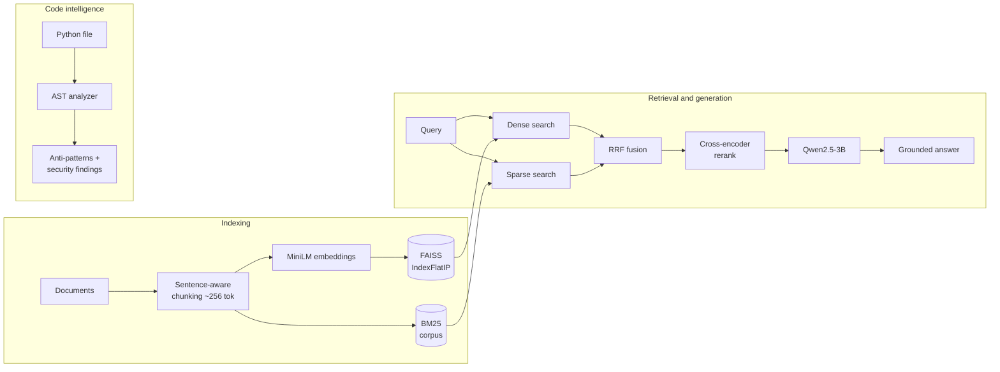

# IntelliCode — Hybrid RAG + AST Code Intelligence

A retrieval-augmented assistant that pairs a **hybrid dense + sparse retriever with cross-encoder reranking** for document Q&A, and an **AST-powered static analyzer** for Python code review. Every retrieval and analysis decision in this repo is backed by a reproducible benchmark that runs in CI — no GPU or API keys required.

[](https://github.com/Divyanshb30/IntelliDoc-RAG-Assistant/actions/workflows/ci.yml)

[](https://huggingface.co/spaces/Divb30/intellicode-rag)

**[▶ Try the live demo](https://huggingface.co/spaces/Divb30/intellicode-rag)** · Qwen2.5-3B · FAISS · BM25 · Cross-Encoder · Python AST

---

## Benchmarks

Retrieval quality on a 30-query labeled evaluation set (25 answerable + 5 out-of-corpus distractors) over a 5-document corpus. Each stage is an ablation adding **one** technique. Reproduce with `python eval/run_benchmarks.py`.

| Configuration | MRR@5 | Recall@1 | Recall@3 | NDCG@5 |
|---|:---:|:---:|:---:|:---:|
| Dense only (MiniLM + FAISS) | 0.883 | 0.800 | 0.960 | 0.913 |
| **+ Hybrid** (BM25 + RRF) | 0.907 | 0.840 | **1.000** | 0.930 |
| **+ Cross-encoder rerank** | **1.000** | **1.000** | **1.000** | **1.000** |

Adding lexical hybrid search lifts Recall@3 to a perfect 1.000; cross-encoder reranking then places the answer-bearing chunk **first** on every answerable query.

> **On methodology.** The eval set is deliberately compact so the full gate runs in CI in minutes on CPU. The signal is the **relative lift each stage contributes** and the fact that these numbers are **regression-gated on every push** ([`eval/baselines.json`](eval/baselines.json)) — not an absolute SOTA claim. Relevance is scored by answer-span containment ([`evaluation.py`](src/intellicode/evaluation.py)), which stays valid when chunk boundaries change, and the five out-of-corpus queries verify the retriever *rejects* unanswerable questions rather than confidently hallucinating.

**AST analyzer accuracy** — measured against an annotated ground-truth fixture with a clean-code false-positive control:

| Precision | Recall | F1 | False positives on clean code |
|:---:|:---:|:---:|:---:|
| 1.00 | 1.00 | 1.00 | 0 |

---

## Architecture



The RAG path and the AST path are independent engines: document Q&A runs the full retrieval + LLM pipeline, while code analysis is pure-Python AST work with no model call — deterministic and instant.

**Deeper design notes, data-flow, and tradeoffs:** [`docs/ARCHITECTURE.md`](docs/ARCHITECTURE.md).

---

## Key design decisions

- **Hybrid retrieval over dense-only.** Dense embeddings miss exact-keyword queries (product names, error codes, acronyms); BM25 catches them. The two rankings are merged with **Reciprocal Rank Fusion** (`score = Σ 1/(k+rank)`, k=60), which needs no score normalization and is robust to the very different score scales of cosine similarity and BM25. Measured: +0.024 MRR@5 and Recall@3 0.96 → 1.00.
- **Cross-encoder reranking as a second stage.** A bi-encoder scores query and passage separately; a cross-encoder (`ms-marco-MiniLM-L-6-v2`, 22M params) scores them jointly and is far more accurate. Running it only on the top-20 candidates keeps it CPU-cheap (<100 ms) while lifting MRR@5 to 1.000.
- **Cosine similarity, not L2.** Embeddings are L2-normalized and indexed with `IndexFlatIP`, so inner product equals cosine similarity — the metric sentence-transformers is trained for, and directly comparable across queries (which the negative-rejection check relies on).
- **Sentence-aware chunking.** Recursive paragraph → sentence → word splitting keeps chunks on semantic boundaries. At matched ~256-token size it beats the naive word-window splitter (MRR@5 0.893 → 0.907) while never cutting mid-sentence.

Every claim above is a row in the [benchmark tables](#ablations) and is gated in CI.

---

## AST analyzer

Detects 12 classes of anti-pattern by walking the AST — **including `async def`**, which the original naive version silently skipped. Function-level checks cover both `FunctionDef` and `AsyncFunctionDef`.

| Severity | Anti-patterns detected |
|---|---|
| HIGH | Mutable default arguments (literals **and** `list()`/`dict()`/`set()` constructors) |
| MEDIUM | Bare `except:`, deep nesting, high cyclomatic complexity, star imports, deeply nested functions |
| LOW | Broad `except Exception`, unused variables, long functions, missing return type hints, `global` statements, `assert` in production code |

A companion **security scanner** flags hardcoded secrets, SQL injection, weak crypto (MD5/SHA1), `eval`/`exec`/`os.system`, insecure deserialization, `shell=True`, and unsafe `yaml.load`.

---

## Quick start

```bash
git clone https://github.com/Divyanshb30/IntelliDoc-RAG-Assistant.git
cd IntelliDoc-RAG-Assistant
pip install -e ".[dev,eval]"
```

```bash
pytest tests/            # unit + integration + eval gates (CPU-only)
python eval/run_benchmarks.py   # regenerate the benchmark tables
```

```python
from intellicode.rag import RAGPipeline

rag = RAGPipeline()
rag.build_index_from_directory("data/sample")
for hit in rag.query("What products does TechCorp offer?"):
    print(round(hit.score, 3), hit.text[:80])
```

Run the Gradio app locally with `python app.py` (falls back to template answers when no GPU/model is available).

---

## Ablations

<details>
<summary>Chunk size (hybrid, no rerank)</summary>

| Chunk size | MRR@5 | Recall@1 | Recall@3 | NDCG@5 |
|---|:---:|:---:|:---:|:---:|
| 128 tokens | 0.863 | 0.760 | 0.960 | 0.898 |
| **256 tokens** | 0.907 | 0.840 | **1.000** | 0.930 |
| 512 tokens | 0.930 | 0.880 | 0.960 | 0.948 |

256 tokens is the default: it achieves perfect Recall@3 while passing more focused (less noisy) context to the LLM. 512 edges MRR@5 slightly but retrieves more extraneous text per chunk and drops a Recall@3 point.
</details>

<details>
<summary>Chunking method at matched size</summary>

| Method | MRR@5 | Recall@1 | Recall@3 | NDCG@5 |
|---|:---:|:---:|:---:|:---:|
| Word-split (~256 tok) | 0.893 | 0.800 | 1.000 | 0.921 |
| **Sentence-aware** (256 tok) | 0.907 | 0.840 | 1.000 | 0.930 |
</details>

---

## Project structure

```
src/intellicode/
├── config.py            # Pydantic settings (env-overridable)
├── rag/
│   ├── chunking.py      # sentence-aware + legacy word-split chunkers
│   ├── retriever.py     # FAISS dense + BM25 sparse + RRF fusion
│   ├── reranker.py      # cross-encoder second stage
│   └── pipeline.py      # ingest → index → query orchestrator
├── analysis/
│   ├── code_analyzer.py # AST anti-pattern detection (async-aware)
│   ├── security_scanner.py
│   ├── test_generator.py
│   ├── code_executor.py # sandboxed subprocess execution
│   └── code_fixer.py
├── agent.py             # intent routing + answer rendering
├── tools.py             # tool registry
├── llm.py               # Qwen2.5-3B backend (optional)
└── evaluation.py        # metrics + eval harness
tests/                   # 121 tests: unit, integration, eval gates
eval/                    # benchmark runner + pinned baselines
```

---

## Tech stack

| Layer | Technology |
|---|---|
| Embeddings | sentence-transformers (`all-MiniLM-L6-v2`, 384-d) |
| Dense index | FAISS `IndexFlatIP` (cosine) |
| Sparse index | `rank-bm25` (BM25Okapi) |
| Reranker | `cross-encoder/ms-marco-MiniLM-L-6-v2` |
| Generation | Qwen2.5-3B-Instruct (HuggingFace ZeroGPU) |
| Code analysis | Python `ast` |
| Config | Pydantic Settings |
| UI / hosting | Gradio · HuggingFace Spaces |
| CI | GitHub Actions (eval-gated) |
