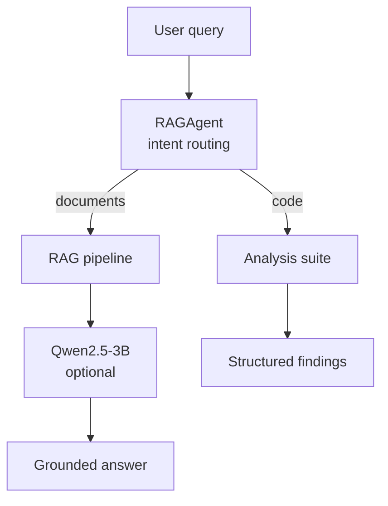

# Architecture

IntelliCode is two independent engines behind one agent: a **retrieval engine**
for grounded document Q&A, and a **static-analysis engine** for Python code
review. They share nothing at runtime except the agent that routes to them.



The design goal throughout: **every quality claim is measurable, and every
measurement runs in CI without a GPU or API key.** That constraint shaped the
module boundaries below.

---

## Retrieval engine

### Indexing path

```
documents → chunk_document() → embed (MiniLM) → FAISS IndexFlatIP
                             ↘ tokenize        → BM25Okapi
```

`HybridRetriever.build_index` ([retriever.py](../src/intellicode/rag/retriever.py))
chunks each document, embeds the chunks once, and builds two parallel indexes
over the *same* chunk list:

- **Dense** — MiniLM embeddings, L2-normalized, added to a FAISS `IndexFlatIP`.
  Inner product over normalized vectors is cosine similarity, so scores are
  bounded in `[-1, 1]` and comparable across queries. `IndexFlatIP` is exact
  (brute force); at portfolio corpus sizes an approximate index (IVF/HNSW)
  would trade recall for speed we don't need.
- **Sparse** — a `BM25Okapi` model over whitespace-tokenized chunks, for exact
  lexical matches (product names, error codes, acronyms) that dense embeddings
  blur together.

Chunk indices are **renumbered globally** after collection. This is subtle but
load-bearing: `chunk_document` numbers chunks per-document, so two documents
would each own a chunk 0. RRF fusion keys on chunk index, so without global
renumbering, chunks from different documents collide and overwrite each other
during fusion. (This was a real bug caught by the retriever unit tests.)

### Query path

```
query → dense top-k ─┐
                     ├→ RRF fusion → cross-encoder rerank → top-k
query → BM25 top-k ──┘
```

1. **Dense + sparse** each return their top-k.
2. **Reciprocal Rank Fusion** merges them: `score = Σ 1/(k + rank_i)`, k=60.
   RRF is rank-based, so it needs no score normalization between the two very
   different scales (cosine ∈ [-1,1] vs unbounded BM25) — the reason it beats a
   tuned linear `α·dense + (1-α)·sparse` combination in practice.
3. **Cross-encoder rerank** (`ms-marco-MiniLM-L-6-v2`) re-scores the fused
   top-20 by feeding `(query, passage)` pairs jointly through a transformer.
   This is the expensive-but-accurate stage, kept cheap by running only over a
   short candidate list. It is lazily loaded and fully optional (toggled by
   `Settings.use_reranker`) so the pipeline degrades to first-stage retrieval
   when reranking is disabled or the model is unavailable.

### Chunking

`chunk_text` ([chunking.py](../src/intellicode/rag/chunking.py)) splits
recursively on the coarsest boundary that keeps chunks under the token budget:
paragraph → sentence → word. Chunks never cut mid-sentence, which keeps the
context handed to the LLM clean. The legacy word-window splitter is retained
behind `chunk_document(strategy="word")` purely so the benchmark can compare
the two methods at matched size — a chunking *strategy* is a config value, not
a code change.

---

## Analysis engine

`CodeAnalyzer` ([code_analyzer.py](../src/intellicode/analysis/code_analyzer.py))
parses source to an AST and runs a battery of independent checks. The central
design point: **every function-level check iterates `(FunctionDef,
AsyncFunctionDef)`**, defined once as `FunctionNode`. The original analyzer
matched only `FunctionDef` and silently skipped every `async def` — a whole
class of modern code invisible to it.

Checks are pure functions of the tree returning `list[Issue]`, so adding a new
anti-pattern is a self-contained method with no cross-check coupling. The
`SecurityScanner` is deliberately regex/line-based rather than AST-based:
security smells like `shell=True` or hardcoded secrets are lexical, and a line
scanner reports precise line numbers with near-zero false positives on the
patterns it targets.

`CodeExecutor` runs untrusted snippets in a **subprocess with a hard timeout**
and size-capped output capture. The docstring is explicit that this bounds
runtime, not privilege — it is not an OS sandbox, and the code says so rather
than implying safety it doesn't provide.

---

## Evaluation as a first-class module

`evaluation.py` ([evaluation.py](../src/intellicode/evaluation.py)) is library
code, not a script, so the same harness backs both the pytest gates
(`tests/eval/`) and the benchmark runner (`eval/run_benchmarks.py`).

- **Retrieval** relevance is *answer-span containment*: a chunk is relevant if
  it contains a gold answer substring. This deliberately avoids labeling chunk
  IDs, which would break the moment chunking changes — the labels describe the
  answer, not the index layout.
- **Analyzer** ground truth lives inline in the fixture as `# EXPECT:` markers,
  parsed at eval time, so the fixture and its labels can never drift apart.
  Precision is measured against a separate clean-code fixture that should
  produce zero findings.

Baselines in `eval/baselines.json` are the CI gate: a change that regresses
MRR@5, Recall@3, or analyzer F1 below the floor fails the build.

---

## Configuration & the LLM boundary

All tunables live in one `pydantic-settings` model ([config.py](../src/intellicode/config.py)),
overridable via `INTELLICODE_*` env vars. Nothing is hardcoded at a call site.

The agent depends only on a tiny `LLMBackend` protocol (`generate(prompt) ->
str`), not on torch or transformers. The concrete Qwen backend lives in
[llm.py](../src/intellicode/llm.py) and is injected at construction. Three
payoffs: the agent unit-tests with a fake LLM and no model download; the whole
system runs in **template-answer mode** with no GPU; and swapping Qwen for
another model is a one-class change that touches nothing else.

---

## Extension points

| To add… | Touch only… |
|---|---|
| A new anti-pattern | one `_check_*` method + one `# EXPECT:` fixture line |
| A new retrieval fusion strategy | `HybridRetriever._rrf_fuse` |
| A different embedding / reranker | `Settings` fields (no code change) |
| A different LLM | a new `LLMBackend` implementation |
| A new eval metric | one function in `evaluation.py` |

## Known limitations

- The eval corpus is small by design (fast CI gate); absolute scores should be
  read as *relative* stage-over-stage deltas, not SOTA numbers.
- `IndexFlatIP` is exact and O(N) per query — correct for this scale, but a
  production corpus of millions of chunks would want IVF/HNSW.
- The subprocess executor bounds runtime, not privilege.
- The token estimator in chunking is a `chars/4` heuristic, not a real
  tokenizer — adequate for chunk sizing, not for exact budget accounting.
